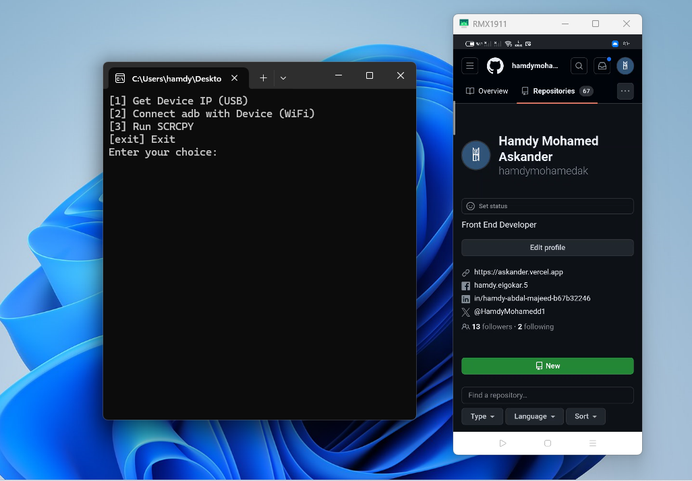

# ADBTOOLKIT
# Download adb and scrcpy

# run adb and scrcpy without command line
## Description
this tool can get your device [IP] and connect your [IP] to adb server and run scrcpy tool to View your ( mobile screen ) at ( LABTOP ) or ( PC ) without useing command line
# you should add path tools at advanced System  => windows 
 and then you can use tool 

